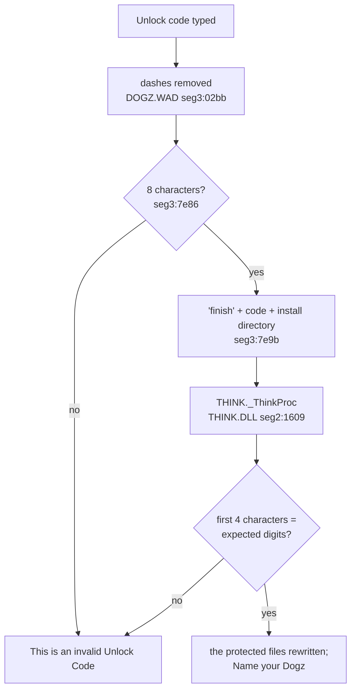

The adoption kit is a trial: five puppies to play with until one is adopted. Adopting one ends at a screen showing a phone number, a "Dogz Validation Code 1.08p" for the caller to read out, and a box for the "Dogz Unlock Code" the operator would give back, in the form `XXXX-XXXX`. This page is how that code is checked, read out of [[file:DOGZ.DOG/DOGZ.WAD]] and [[file:DOGZ.DOG/THINK.DLL]]. The checks live in the protection library described in [[topic:copy-protection]].

## The answer

- [[read out]] Only the first four characters of the code are checked. They must be the first four digits of a number made from the volume serial number of the first hard disk.
- [[measured]] DOSBox reports no volume serial number, so on any installation under DOSBox the expected digits are `3485`, and `3485-0000` adopts the puppy. The oracle's `scripts/oracle/register-dogz.mjs` adopts with it, and `src/protection/unlock.ts` computes it.
- [[read out]] The validation code shown on the screen plays no part in the check. Setup writes one for each installation into [[file:DOGZ.DOG/NEURON.DLL]] (below).

## What the screen does with the code

- [[read out]] `DOGZ.WAD` seg3:7e2a reads the box with `GetDlgItemText` (USER.93), and seg3:02bb copies it without its dashes. Anything but eight characters after that is refused at seg3:7e86 without calling `THINK.DLL` at all. [[measured]] A twelve-digit code is refused this way.
- [[read out]] Eight characters are passed to `THINK.DLL`'s `_ThinkProc` (ordinal 2) as one string, `finish`, the eight characters, then the install directory, made with `wsprintf` and the format `%s%s%s` at seg3:797c. [[inferred]] The directory is the string at `ds:2a14`, which seg2:0153 also joins to `art\picture.art` and the other protected file names.
- [[read out]] `_ThinkProc` (seg2:1609) recognises three commands by their prefix: `spawn`, `skulk` and `finish`. For `finish` it computes the expected digits into a buffer (seg2:16e7 to 16fb) and compares them with `strncmp(code, expected, 4)` (seg2:1701 to 171c). Only on a match does it go on to the protected files, with the directory that follows the eight characters (seg2:173a adds 8).
- [[read out]] On a failure the screen counts down a number of tries at offset `0x150` of its window data, starting from four (seg3:7ee7 to 7f1b). Not yet known: what the last failure leads to.

## The expected digits

`THINK.DLL` seg2:0538 finds the first hard disk, and seg2:031a turns its serial number into four digits.

- [[read out]] It tries drives 3 to 6 (C: to F:) with `_dos_setdrive`, and stops at the first one that becomes current. For that drive, seg2:0415 asks DOS for its media ID: INT 21h with `AX=6900h` and `BL` the drive, issued through DPMI's "simulate real mode interrupt" (INT 31h `AX=0300h`, seg2:03f5) on a buffer from `GlobalDosAlloc`.
- [[read out]] If DOS sets the carry flag, the serial number is taken as 0 (seg2:04b1). The serial number is then written in hexadecimal with Borland's `ltoa(serial, buffer, 16)` (seg2:0514) and upper-cased (seg2:0528).
- [[read out]] If `GlobalDosAlloc` fails, the string is `AE45BC92`. If no drive from C: to F: can be made current, it is `8E3B27C5`, assembled at seg2:0620 from `8E`, `3B`, `27` and `C5`.
- [[read out]] seg2:031a takes characters 6, 4, 0 and 2 of that string and maps each through a table at seg2:01e7. It packs the four results into one number, `t[6] << 12 + t[4] << 8 + t[0] << 4 + t[2]`, prints it with `%ld`, and turns anything in the first four places that is not a digit into an `8`.

| Character | `0` | `1` | `2` | `3` | `4` | `5` | `6` | `7` | `8` | `9` | `A` | `B` | `C` | `D` | `E` | `F` | anything else |
| --------- | --- | --- | --- | --- | --- | --- | --- | --- | --- | --- | --- | --- | --- | --- | --- | --- | ------------- |
| Value     | 2   | 0   | 15  | 13  | 1   | 14  | 7   | 10  | 9   | 4   | 6   | 3   | 11  | 8   | 5   | 12  | 8             |

## Under DOSBox

- [[measured]] DOSBox 0.74-3 answers INT 21h `AX=6900h` with the carry flag set for a drive mounted from a host directory. A twelve-line test program, run in DOSBox with C: mounted as the oracle mounts it, read carry set and left its buffer untouched.
- [[read out]] So the serial number is 0, and the string is `0`: character 0 is `0`, worth 2. Characters 2, 4 and 6 lie past the string's end, in whatever the buffer held before. That buffer is uninitialised stack in `_ThinkProc`'s frame (`bp-0x204`).
- [[measured]] On the oracle they were not hex digits, and each counted as 8. That gives `8 << 12 + 8 << 8 + 2 << 4 + 8` = 34856, so the expected digits were `3485`. `3485-0000` adopted the puppy, in the exploration that found this and in every scripted adoption since.
- [[inferred]] Stack contents that happened to include a hex digit in one of those three places would give different digits. Nothing has been seen to do so. A failed adoption under `register-dogz.mjs` is the first place to look if it ever happens.

## The validation code

- [[read out]] `DOGZ.WAD` seg3:8268 builds the code it shows. It asks `THINK.DLL` for a time id (`_GetTimeId`, ordinal 5, seg2:150f), which is the last four digits of `time()` printed in decimal. The last of those digits picks one of three branches through the jump table at seg3:878b (digits 0 to 9 go to branches 0, 1, 2, 1, 0, 2, 0, 2, 2, 1).
- [[read out]] Each branch copies a 22-digit string out of [[file:DOGZ.DOG/NEURON.DLL]] (ordinals 2, 3 and 4). It then has `THINK.DLL`'s `_LookAtBrain` (ordinal 6, seg2:003e) subtract that branch's 18 digit keys from the string's first 18 digits, modulo 10 (mode `0x541`; mode `0xED` adds them). The first 19 digits, with a dash every four, are what the screen shows.
- [[measured]] The three strings are not the same on two installations: Setup rewrites them in `NEURON.DLL`'s data segment (file offset `0x1c70` onwards) each time. On each of the oracle's installations so far, all three branches decoded to the same 19 digits, and those were what the screen showed: `0331-8556-9724-8845-863` on one and `5958-6801-1764-4833-575` on another. So the validation code names the installation, whatever the time it is shown. `src/protection/unlock.ts` decodes it, and its test holds both installations to what their screens showed.
- [[inferred]] Setup makes the strings with `THINK.DLL`'s `spawn` command: `%sneuron.dll` is among the file names in `THINK.DLL`'s data segment, beside the [[format:marker]] files'. Not yet known: what the 19 digits encode, and so how a PF.Magic operator would have turned them into an unlock code, when the code checked comes from the disk's serial number instead.
- [[measured]] The adoption writes the 19 digits to [[file:DOGZ.DOG/DOGZ.INI]] as `Serial Number=`, with `Serialized=1`.
