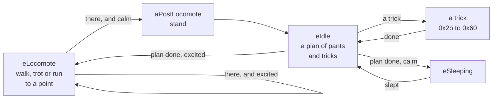

What the dog does is DOGZDLL.DLL's class `PetModule`. It is a state machine: each state pushes scripts ([[format:scp]]) onto the dog's queue, and reacts as the queue plays out a frame a tick. Every choice is `rand() % n` of Borland C's `rand` (seg1:4f11). `src/behaviour/pet.ts` reimplements the states a dog left to itself goes through, and the viewer's **Live** box runs it.

## States

- [[read out]] The engine has 109 states, named in its string table from 10000: 0 `eNOTASTATE`, 4 `eIdle`, 5 `eSleeping`, 7 `eLocomote`, 0x2b `eTrickBegging` to 0x65 `eTrickBalanceBall` (the 59 tricks), to 108 `eIconBeg`. `StateDispatch` (seg21:503f) calls each state's handler; `NewState` (seg21:5bb8) calls the old one leaving, glues the dog by the chest unless the queue is already glued, and calls the new one entering, at once.
- [[read out]] Above the states are global states, from 1000: idle, begging for a treat, playing ball and others, which set what the states do with the user (`NewGlobalState`, seg21:5dfa). Left alone the dog is in 1000, and `EnterIdle` starts it walking.
- [[read out]] A handler pops the queue each tick (`ScriptSprite::PopScript`), which shows a frame and returns flags: 1 when the queue has run out, 2 when the dog has reached its target, 8 when the queue says which state to go to next (`0x8b07 n`).

## Positions and transitions

- [[read out]] Every script goes from one of 59 positions to another ([[format:scp]]), and each position has a kind, the word after its name: 1 moving, 2 lying, 4 on its back, 8 sitting, 16 standing, or a sum (`GetNeutralType`, seg7:2cfd). `walking` is 17.
- [[read out]] `LoadScripts` keeps, for each pair of positions, the first script in the file from the one to the other (seg7:2180). Its test for a flagged script and its test for any are in the same pass, so the flag changes nothing.
- [[read out]] To play a script, `PushStoredScript` (seg7:4367) first takes the dog to where it starts (`PushTransitionToNeutralPos`, seg7:3d2f): the pair's script, or the first two that join, or the first three, each later one glued by the chest; then glues by the belly, unless the script is the one just played. A sitting dog standing up stands up excitedly instead (script 202 for 73) when `rand() % 30 + 30` is below its excitement; a clumsy one trips (224 for 10).

## Idle

- [[read out]] Entering idle with no plan, the dog stands, if `rand() % 100` is below its excitement, or sits, and makes a plan (`SetupIdle`, seg16:0104): `rand() % (13 − e/10) + 6 − e/20` items, e its excitement. Each is a trick if `rand() % 100` is at most e; otherwise one to four runs of one to three pants, each run maybe followed by a pant looking about.
- [[read out]] A longer pant is meant to follow too, but the engine tests `(rand() == 0) % 3`: one time in 32,768.
- [[read out]] As the queue runs out the next item plays (`DoIdle`, seg16:02ce): a pant is script 2 standing or 74 sitting. When the plan is done the dog sleeps if `rand() % 30 + 30` is more than its excitement, and otherwise walks off. A dog of excitement 59 or more never sleeps so; one below 30 always does.

## Tricks

- [[read out]] An idle trick is chosen by picking one of the 59 at random until one passes, in this order (seg16:0724 to 088f), every test against [[format:tdt]]:
  1. the dog's excitement is within the trick's range of the excitement it suits;
  2. its idle weight is at least `rand() %` the sum of all idle weights;
  3. `rand() %` each of ham, sickness, groom and bark is at most what the trick tolerates of it;
  4. it is not a trick with the ball.
- [[read out]] The dog then turns to face the user, if it faces further away than the trick allows: turning round on the spot if that is enough, otherwise walking round (`DoBeggingTrick`, seg18:0722). Rotation 0 faces the user.
- [[read out]] `PushTrick` (seg21:708a) plays a trick's script, from a table of six bytes a trick at DS:0x216e, `repeats + rand() % extra` times, with cues before and around it. Five tricks it plays its own way: roll-and-wiggle one of four rolls at random, run-in-circles a run drifting 8 to 11 a frame round, bark sitting or standing, boing spinning, sneeze glued between.
- [[read out]] When begging, `PickTrickState` (seg21:6907) asks the brain ([[format:pbt]]) first, and picks at random only when "brain has no opinions".

## Sleep

- [[read out]] Unless on its back, a dog going to sleep circles (script 212) and lies down (213). It sleeps through a plan of 10 to 24 stretches, each one of five sleeping scripts played a few times, broken every six to twelve stretches by one of two others (`PushSleepScripts`, seg16:1f61, the scripts at DS:0x20a4 and 0x20b8). Then it goes back to idle. Being disturbed wakes it; not yet played.

## Walking about

- [[read out]] `PickLocomotionAction` (seg21:837c) walks (13), trots (71) or runs (9) by `((rand() % 21 + e − 10) × 3) / 100`; a hammy dog sometimes struts (241) or marches (111), and a dull one walks sadly (220). `GetNewTarget` (seg16:177b) picks a point on the stage, 60 pixels in from its edges, at least 400 pixels away — or, on a smaller stage, half the diagonal inside those margins less 50.
- [[read out]] Reaching it, the dog stops if `rand() % 150` is at least its excitement, and otherwise picks another (`DoLocomote`, seg16:1263).
- [[inferred]] How the sprite steers the dog to its target is not yet read. The reimplementation eases the dog's rotation, over each stretch of walking, to face the target, and counts it reached within 24 pixels.

## Excitement and the factors

- [[read out]] A dog's nature is eleven factors, from 1 to 100: excitement, naughty, grab object, clumsy, groom, ham, bark, sickness, spray fear, frustration and age, in the order of the breed's `[Default Factors]` ([[format:lnz]]). Each line is a centre and a spread. `LoadFactors` (seg21:1ec5) sets each factor to its centre moved, either way, by `spread − √(rand() % spread²)`: near the centre more often than not. Age sets factor 10, and a younger dog is clumsier, by (100 − age) / 3.
- [[read out]] Excitement is not fixed: it is `100 × ((1 + sin(φ + π t / 24,000)) / 2)^((100 − c) / 25)`, t the engine's clock in ticks of 17 milliseconds, c the excitement's centre (`PulseTrickData`, seg14:1783). It rises and falls over about 13 minutes, and a calmer breed spends longer low. Setting it moves φ so that it is the value set, now (`SetExcitement`, seg14:2363).
- [[read out]] Now and then the other factors step 1 back towards their centres, as the trick weights do ([[format:tdt]]).

## Not yet

- [[read out]] The user's side: petting, the ball, treats, the spray bottle, the cursor games and the brain's learning are states this does not yet play. Nor `eComplexTrickChasingWall`, which an idle dog can choose; its handler is `DoTargettedLocomote`, and the reimplementation goes straight back to idle.
- [[inferred]] `ResetScriptSoft`, which a state calls leaving, is taken to let the script playing finish and drop the rest.
