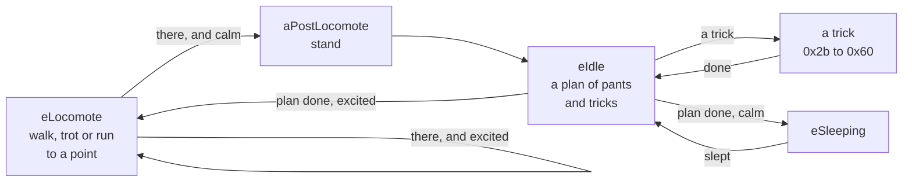

What the dog does is DOGZDLL.DLL's class `PetModule`. It is a state machine: each state pushes scripts ([[format:scp]]) onto the dog's queue, and reacts as the queue plays out a frame a tick. Every choice is `rand() % n` of Borland C's `rand` (seg1:4f11). `src/behaviour/pet.ts` reimplements the states a dog left to itself goes through, and the viewer's **Live** box runs it.

## States

- [[read out]] The engine has 109 states, named in its string table from 10000: 0 `eNOTASTATE`, 4 `eIdle`, 5 `eSleeping`, 7 `eLocomote`, 0x2b `eTrickBegging` to 0x65 `eTrickBalanceBall` (the 59 tricks), to 108 `eIconBeg`. `StateDispatch` (seg21:503f) calls each state's handler; `NewState` (seg21:5bb8) calls the old one leaving, glues the dog by the chest unless the queue is already glued, and calls the new one entering, at once.
- [[read out]] Above the states are global states, from 1000: idle, begging for a treat, playing ball and others, which set what the states do with the user (`NewGlobalState`, seg21:5dfa). Left alone the dog is in 1000, and `EnterIdle` starts it walking.
- [[read out]] A handler pops the queue each tick (`ScriptSprite::PopScript`), which shows a frame and returns flags: 1 when the queue has run out, 2 when the dog has reached its target, 8 when the queue says which state to go to next (`0x8b07 n`).

## Positions and transitions

- [[read out]] Every script goes from one of 59 positions to another ([[format:scp]]), and each position has a kind, the word after its name: 1 moving, 2 lying, 4 on its back, 8 sitting, 16 standing, or a sum (`GetNeutralType`, seg7:2cfd). `walking` is 17.
- [[read out]] `LoadScripts` keeps, for each pair of positions, the first script in the file from the one to the other (seg7:2180). Its test for a flagged script and its test for any are in the same pass, so the flag changes nothing.
- [[read out]] To play a script, `PushStoredScript` (seg7:4367) first takes the dog to where it starts (`PushTransitionToNeutralPos`, seg7:3d2f): the pair's script, or the first two that join, or the first three, each later one glued by the chest; then glues by the belly, unless the script is the one just played. A sitting dog standing up stands up excitedly instead (script 202 for 73) when `rand() % 30 + 30` is below its excitement; a clumsy one trips (224 for 10).

## Idle

- [[read out]] Entering idle with no plan, the dog stands, if `rand() % 100` is below its excitement, or sits, and makes a plan (`SetupIdle`, seg16:0104): `rand() % (13 − e/10) + 6 − e/20` items, e its excitement. Each is a trick if `rand() % 100` is at most e; otherwise one to four runs of one to three pants, each run maybe followed by a pant looking about.
- [[read out]] A longer pant is meant to follow too, but the engine tests `(rand() == 0) % 3`: one time in 32,768.
- [[read out]] As the queue runs out the next item plays (`DoIdle`, seg16:02ce): a pant is script 2 standing or 74 sitting. When the plan is done the dog sleeps if `rand() % 30 + 30` is more than its excitement, and otherwise walks off. A dog of excitement 59 or more never sleeps so; one below 30 always does.

## Tricks

- [[read out]] An idle trick is chosen by picking one of the 59 at random until one passes, in this order (seg16:0724 to 088f), every test against [[format:tdt]]:
  1. the dog's excitement is within the trick's range of the excitement it suits;
  2. its idle weight is at least `rand() %` the sum of all idle weights;
  3. `rand() %` each of ham, sickness, groom and bark is at most what the trick tolerates of it;
  4. it is not a trick with the ball.
- [[read out]] The dog then turns to face the user, if it faces further away than the trick allows: turning round on the spot if that is enough, otherwise walking round (`DoBeggingTrick`, seg18:0722). Rotation 0 faces the user.
- [[read out]] `PushTrick` (seg21:708a) plays a trick's script, from a table of six bytes a trick at DS:0x216e, `repeats + rand() % extra` times, with cues before and around it. Five tricks it plays its own way: roll-and-wiggle one of four rolls at random, run-in-circles a run drifting 8 to 11 a frame round, bark sitting or standing, boing spinning, sneeze glued between.
- [[read out]] When begging, `PickTrickState` (seg21:6907) asks the brain ([[topic:brain]]) first, and picks at random only when "brain has no opinions".

## Sleep

- [[read out]] Unless on its back, a dog going to sleep circles (script 212) and lies down (213). It sleeps through a plan of 10 to 24 stretches, each one of five sleeping scripts played a few times, broken every six to twelve stretches by one of two others (`PushSleepScripts`, seg16:1f61, the scripts at DS:0x20a4 and 0x20b8). Then it goes back to idle. Being disturbed wakes it; not yet played.

## Walking about

- [[read out]] `PickLocomotionAction` (seg21:837c) walks (13), trots (71) or runs (9) by `((rand() % 21 + e − 10) × 3) / 100`; a hammy dog sometimes struts (241) or marches (111), and a dull one walks sadly (220). `GetNewTarget` (seg16:177b) picks a point on the stage, 60 pixels in from its edges, at least 400 pixels away — or, on a smaller stage, half the diagonal inside those margins less 50.
- [[read out]] Reaching it, the dog stops if `rand() % 150` is at least its excitement, and otherwise picks another (`DoLocomote`, seg16:1263).
- [[read out]] Steering is the sprite's (`ScriptSprite::SetTargetLocation`, seg7:295e; `PopScript`, seg7:6b38 to 6d24). A target is a point, a rate of turn — 6 in 256ths of a turn a frame — and a box. Each frame the target is reached if it falls in the box: as wide and high as given, centred ahead of the nose (ball 55) by the box's diagonal over a distance, 4, the way the dog faces (`MakeFocusRect`, seg7:3565). Otherwise the dog's rotation is set turning towards `atan2(−dy, −dx) × 256 / 6.283 + 64`, wrapped to ±128, from the middle of the rectangle it is drawn in, the shorter way round (`AngleFudger::SetTarget`, seg4:0e98).
- [[read out]] The box is the pet's standard size — frame 35 drawn side on (`FigureOutStandardWidthAndHeight`, seg21:0289) — times 0.8 walking, 0.5 trotting, and 1.2 by 0.7 of its width running (`GetLocomotionFudge`, seg21:85ad). Walking about, the target is set again at the start of each stride (cue 4).

## Chasing

- [[read out]] `DoTargettedLocomote` (seg21:79d4) runs every state that chases something: the cursor (3, and 0x13 to be petted), the treat held (0x26), a wall (0x54), the ball. It walks, trots or runs — trotting after the cursor to be petted, running at the wall, by excitement after a treat — steering at the target each stride. A user waggling the target hurries it: a walk to a trot, a trot to a run (`PickFasterLocomotionAction`).
- [[read out]] Reaching it, the dog waits to be petted, does a trick for the treat (`PickTrickState`), or lunges at the wall (`DoLungingWall`, seg16:22c1: turned to it, scripts 263, 228, and 227 two to four times). Running or trotting, a clumsy dog trips (`DoLocomoteTrip`, seg21:8735: script 155 or 24 out of a run, 204 out of a trot) and goes back to what it was doing; stopped out of a run, it skids (script 205) one time in three.
- [[read out]] The wall chased is the far one: the stage's right edge less the standard width if the dog is in the left half, else its left edge plus it, at its height give or take 70, kept 150 from the top and bottom.

## Excitement and the factors

- [[read out]] A dog's nature is eleven factors, from 1 to 100: excitement, naughty, grab object, clumsy, groom, ham, bark, sickness, spray fear, frustration and age, in the order of the breed's `[Default Factors]` ([[format:lnz]]). Each line is a centre and a spread. `LoadFactors` (seg21:1ec5) sets each factor to its centre moved, either way, by `spread − √(rand() % spread²)`: near the centre more often than not. Age sets factor 10, and a younger dog is clumsier, by (100 − age) / 3.
- [[read out]] Excitement is not fixed: it is `100 × ((1 + sin(φ + π t / 24,000)) / 2)^((100 − c) / 25)`, t the engine's clock in ticks of 17 milliseconds, c the excitement's centre (`PulseTrickData`, seg14:1783). It rises and falls over about 13 minutes, and a calmer breed spends longer low. Setting it moves φ so that it is the value set, now (`SetExcitement`, seg14:2363).
- [[read out]] Now and then the other factors step 1 back towards their centres, as the trick weights do ([[format:tdt]]).

## The cursor

- [[read out]] [[file:DOGZ.DOG/DOGZ.WAD]] hands the engine the cursor, in the playpen's coordinates, and the primary and secondary mouse buttons, read with `GetAsyncKeyState` the way `SwapMouseButton` says they are (seg4:014d and 0187 of `DOGZ.WAD`). It draws a frame every 45 milliseconds at most (`ReallyDoDrawFrame`, seg21:3dee), so about 22 a second.
- [[read out]] Each frame the engine keeps the cursor's last thirty positions and buttons, and works out whether it waggles: over the last five frames, moving 8 pixels a frame or more, but never more than 100 from where it is now (seg21:4700 to 4899).
- [[read out]] What is under the cursor is a ball: `Ballz::HitTest` (seg10:46d8) tries the balls nearest first, each a square as wide as it is drawn. Each ball is a part of the body, set one by one in the `Ballz` constructor (seg10:0051 on): 0 the head, ears and neck, 1 the tongue, 2 the face, 3 the hindquarters and the root of the tail, 4 the right leg, 5 the left, 7 the tail, 8 the chest, belly and shoulders.

## Petting

- [[read out]] Every frame, `DoPettingHandler` (seg17:0000) takes for petting the button held down over the dog for four frames running, with the cursor moving in at least two of them; not while a treat is held, not while the dog is running. Petting starts the global state 0x3f3.
- [[read out]] A click on a standing dog's face, a leg or the tail is a poke: `ePettingBad` (seg17:1416). Its bark factor rises by 5; poked in the face it shies or snaps (one of DS:0x20ca), elsewhere it growls or flinches; three times in four it shakes it off.
- [[read out]] The dog wants petting on one of three spots, picked by chance — the chest, 20 in 100, the belly, 30, the rump, 50 — for a few strokes before it picks another (`PickNewPetSpot`, seg17:192b). The cursor is on the spot within 0.8 of the spot's ball's drawn width either side of it, at any height within 300 pixels (`IsCursorOverPetSpot`, seg17:17de).
- [[read out]] Facing the user or away, the dog first turns side on and walks back or forth until its spot is under the cursor (`DoAligningPetting`, seg17:08f7); then it waits, panting, 20 to 39 pants before it gives up (`DoWaitPetting`, seg17:0410); a cursor that leaves it is followed.
- [[read out]] Each stroke (`DoPettingGood`, seg17:0e25) raises how much it has enjoyed the petting, up to 16. Stroked on the head or body it leans into the hand (scripts 47 and 45), on the hindquarters it thumps a leg (64, 65, 66), and the more it has enjoyed, the likelier, out of 16, it rolls onto its back instead. On its back it wriggles (DS:0x20c4); enjoyed past 14, rolled on its back, and calm enough by `rand() % 150` against its excitement, it falls asleep.
- [[inferred]] How the dog turns side on to be petted is not yet read; the reimplementation turns it a quarter turn.

## Treats

- [[read out]] The food sprites are, in order, `Food`, `Water`, `BlueTreat`, `GreenTreat` and `RedTreat` (`FoodSprite::theirNames`), and each is a global state, 0x3eb to 0x3ef. `FoodSprite::Update` (seg20:0de4) sets them: a treat picked up starts the dog after it; put down, the dog goes to eat it; picked up again while it eats, it begs again; put back in the box, it is left alone.
- [[read out]] For a treat held, the dog sits up and begs, five to ten times (script 14; `DoBegging`, seg18:0bec). Then `ActivateBrain` (seg18:290d) wakes the brain ([[topic:brain]]), telling it the treat was brought out, and `PickTrickState` chooses: the dog's frustration rises by 4, and if `rand() % 420` is below it, and again below its grab-object factor, it snatches the treat from the user's hand (`DecideIfGrabFromUser`, seg14:215e). Otherwise it does a trick: the brain's choice, or, when "brain has no opinions", one at random that needs no ball.
- [[read out]] After a trick done begging, it pants and waits for the treat, from `(100 − e) / 20 + 1` pants to nearly four times as many, sitting more often the calmer it is (`PushBegWaitLoops`, seg18:25e0). Waggling the treat while it waits has it do another trick at once; taking the treat away has it follow.
- [[read out]] A treat put down is eaten in one bite (script 86; `DoEating`, seg18:12cb). Its cue 10 is the bite: the treat is gone, the dog's frustration settles to its centre, and, only if the brain was not yet woken, the trick last done is rewarded ([[format:tdt]]). So the trick weights learn only from a treat given before the dog has begged; once it has, what it learns is the brain's.
- [[inferred]] How the dog walks to a treat put down, and its following the treat about while it begs, are simplified: it steers to the treat as when chasing.

## Fetch

- [[read out]] The ball is a sprite of its own, `BallSprite` (seg20). Taken out of the toy box it starts the global state 0x3f0, playing ball (`EnterFetch`, seg19:0000): held, the dog begs for it as for a treat, and picks tricks by their play weight ([[format:tdt]]); a frustrated, grabby dog may leap and snatch it from the hand (`PickTrickState`, seg21:6907). Put back in the box, the dog is left alone.
- [[read out]] Held, the ball follows the cursor, and its speed is half how far the cursor moved since the frame before (`BallSprite::Update`, seg20:20b8). Let go, each frame it loses a fortieth of its speed, stops once below a pixel a frame each way, moves by the whole pixels of its speed, and bounces straight back off the stage's edges (`UpdateLocation`, seg20:2634). It is moving fast above 120 pixels squared a frame (`IsMovingFast`), and `ProjectLocation` rolls it on so many frames to say where it will be and how often it will bounce.
- [[read out]] Thrown, the dog's frustration settles, and it chases the ball, if `rand() % 30` is below its excitement plus 10 or its head is off the stage; otherwise it sits and watches, six to ten pants, and loses interest (`DoObservingBallThrown`, seg19:022b).
- [[read out]] Chasing (0x18), it steers at where the ball will be four frames on (seg21:7a8f). Running, if the ball will pass within 75 of a point 200 above its chin in the next fourteen frames, bouncing at most once, it leaps for it (seg21:7f4d: scripts 26 and 25, `DoJumpingGrabbingBall`, seg19:0e30); a clumsy dog misses (60 to look again, maybe). Reaching a ball that will not bounce in four frames, it grabs it (`DoGrabbingBall`, seg19:0941): a pounce (29) if the ball has not moved since it put it down, otherwise reaching down (82) and grabbing (81) (`PushBallGrabAction`, seg19:2bf9); a clumsy dog fumbles it (185, 186) and chases it again.
- [[read out]] `0x8b03 slot` and `0x8b04 slot` in a script grab and let go of the object at play (`GrabObject`, seg14:04e4, and `ReleaseObject`): slot 0 is the mouth, ball 51, the chin, and slot 1 a paw, ball 45. Held, the ball goes where that ball of the dog goes; let go, it rests there. `GrabObject` takes the ball wherever it is, only not from the user's hand unless the dog is snatching it.
- [[read out]] `0x8af4 ball x y` slides the dog, evenly over the frames up to the next cue 2, so that its ball is at the point when that frame shows; `0x7ffd` for x is the ball at play (`PopScript`, seg7:5e98 and 7144 on). So the grab lands the chin on the ball, and the leap meets it in the air.
- [[read out]] With the ball, a dog decides whether it is naughty, `rand() % 100` below its naughty factor (`DecideIfNaughty`, seg14:20a6). Good, it runs back to the user (0x19: at the cursor, kept within 100 of the dog); naughty, somewhere far from the dog and the user (0x1a, `GetNewNaughtyTarget`, seg19:275f). There it stops, turns round if facing more than 0x50 away, and drops the ball (script 8; `DoReleasingBall`, seg19:033d, `PushBallReleaseAction`, seg19:2a84). A naughty dog snatches it back when the cursor reaches for it.
- [[read out]] Then it waits for the next throw, doing a trick or two by play weight between pants (`DoAnticipatingBall`, seg19:101d; a naughty dog guards it, 0x1c); if the cursor moves off, it takes up the ball and brings it again, and after enough it loses interest and goes back to idle. A trick with the ball needs the ball free and within a box half again its standard size ahead of it (`IsBallGrabbable`, seg19:018e): nosing it (102), walking on it (88, 89), bouncing on it (87), throwing it (97) and chasing it, balancing it (85) (`PushBallTrick`, seg21:6bde).
- [[inferred]] The ball's picture is not yet read: the viewer draws a circle 12 pixels across. Where `0x8af4` plays the frames ahead to know where the ball will be, the reimplementation takes the target frame as though the dog stood still. The distances `GetNewNaughtyTarget` is called with are inferred.
- [[inferred]] On a stage smaller than Dogz's own screen a dog runs far enough to drop the ball off it, and fetches it again and again; the viewer's live stage is 640 by 480, as the game's.

## Not yet

- [[read out]] The spray bottle, the cursor games and scruffing are states this does not yet play; nor, at play, the dog faking a throw, tumbling with the ball, the user too close, turning to the ball before a grab (`0x8ae8`), or the ball moved during a ball trick (`0x8aed`, `0x8af4`).
- [[read out]] `DoTargettedLocomote` passes the target's distance from a local it never sets; the reimplementation passes 4, as `DoLocomote` does.
- [[inferred]] `ResetScriptSoft`, which a state calls leaving, is taken to let the script playing finish and drop the rest.
