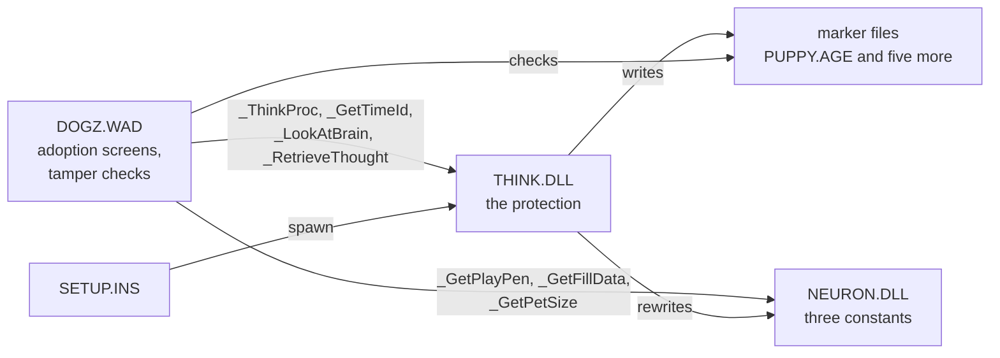

The adoption kit is a trial until a puppy is adopted with an unlock code. The protection behind that is spread over three files, and everything in it is named to look like something else: a "brain" library, "neuron" functions, files called `puppy.age` and `picture.art`. What each part is, so far:

## The protection library

[[file:DOGZ.DOG/THINK.DLL]] is 53,589 bytes, Borland C++ 1994, importing only from KERNEL and USER. [[read out]] Its exports are `_ThinkProc` (2), `_RetrieveThought` (3), `_ConvertThoughtToIds` (4), `_GetTimeId` (5) and `_LookAtBrain` (6), and none of them thinks:

- `_ThinkProc` takes a command and a directory as one string: `spawn`, `skulk` or `finish`. `finish` is the unlock, and checks the code first ([[topic:adoption-unlock]]). [[inferred]] Each command writes the [[format:marker]] files.
- `_GetTimeId` writes the last four digits of `time()`.
- `_LookAtBrain` adds or subtracts one of three fixed 18-digit keys, digit by digit, modulo 10.
- `_RetrieveThought` reads a stretch of a file. The game checks the marker files with it.
- Not yet known: `_ConvertThoughtToIds`, and the `skulk` command.

[[measured]] Setup installs `THINK.DLL` as it is on disk 1, uncompressed, not out of the compressed libraries. [[inferred]] `SETUP.INS` also names `THINKSP.DLL` and `SETUPSPA.INS` beside `THINK.DLL` and `SETUP.INS`, most likely for a Spanish edition.

## The constants library

[[file:DOGZ.DOG/NEURON.DLL]] is 13,456 bytes. [[read out]] Its three exports, `_GetPlayPen`, `_GetFillData` and `_GetPetSize` (ordinals 2 to 4), each `wsprintf` one 22-digit string from its data segment into the caller's buffer and do nothing else. [[measured]] Setup rewrites those strings in the file for each installation: they are the installation's encoded validation code ([[topic:adoption-unlock]]).

## Tamper checks in DOGZ.WAD

[[read out]] [[file:DOGZ.DOG/DOGZ.WAD]]'s segment 2 exports five functions that take one short each: `NeuronOne`, `NeuronTwo`, `GetDrawingPen`, `GetHighlightInfo` and `SetFillPattern` (ordinals 1 to 5, seg2:0a6b to 0dbb). Each is a latch.

- The first call, recognised by a magic word at `ds:1eb0` to `1eb8`, stores its argument, or the argument plus a constant.
- Every later call compares its argument with what was stored. On a mismatch it clears the word at `ds:27bc`, and unless `ds:2d30` already holds 6 or `ds:281e` is set, it sets `ds:2d30` to 6 and calls seg5:1281.
- On a match it returns a constant: `0x237`, `0xdaf1` and `0xf706` for the first three. The last two return `0x39a4` and `0xdce4` whatever happens.

[[inferred]] `ds:27bc` is the game's "protection intact" flag, since every check that passes sets it to 1. State 6 is the "Security Error" whose text is in `SETUP.INS` ("You may be missing certain Dogz files. Try reinstalling Dogz."). Not yet known: who calls the five latches, and with what.

## The integrity check

[[read out]] `DOGZ.WAD` seg2:008b builds the paths of marker files under the install directory and checks them with `_RetrieveThought` (above, and [[format:marker]]). It does not check every file every time: of `picture.art`, `neuron.dat` and `sound.inf`, a digit of `_GetTimeId` picks one (seg2:01ad), and more checks follow at seg2:0455 and 04d2. A file that fails clears `ds:27bc` and sets state 6, as the tamper checks do. Before that it copies `12345678`, `98765432` and the 19 digits at `ds:0088` into its frame, then overwrites the last with a `NEURON.DLL` string chosen by `_GetTimeId` and decodes it with `_LookAtBrain`: the same validation code the adoption screen shows. Not yet known: what it does with it, or with the two eight-digit strings.
