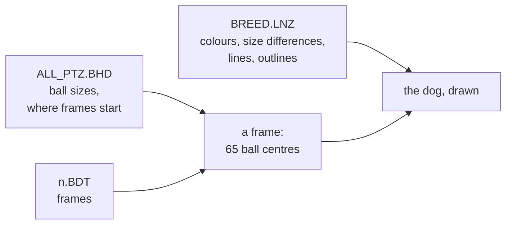

Dogz draws its pets in real time, out of balls: filled circles in three dimensions, drawn nearest last, joined by thick lines. Every breed shares one skeleton of 65 balls and its 36 animations ([[format:bhd]], [[format:bdt]]). A breed file ([[format:lnz]]) says how each ball looks. [[file:WINDOWS/DOGZDLL.DLL]]'s class `Ballz` and `XDrawPort`'s `XFillCircle` are where the game does it.

## What the viewer does

`pnpm dev`, then `/viewer.html`, draws any breed in any frame of any animation from the game's own files: the oracle's, in development, or a `DOGZ.DOG` directory chosen in the page, which never leaves the browser.

- [[read out]] Positions: x across, y down, a larger z farther ([[format:bdt]]). Every ball and line is drawn in order of depth, farthest first; a line's depth is its two ends' average.
- Sizes: the skeleton's diameter plus the breed's `Ball Size Diffs`, at one pixel and a half to the unit. Not yet measured against the game.
- Lines: from the `Linez` section, round-ended, as thick as half the smaller end's diameter, in the first ball's colour. Not yet measured.
- Outlines: from `Outline Type` and `Outline Color`; a half outline is drawn round the lower half of the ball. Not yet measured.
- Colours: the `16 Ball Color` section, read as the 16 colours its comment names. [[inferred]] Some of what that gives is not what the game shows — a teal terrier, a green chihuahua — so either the colours are not Windows' 16 in that order or the game does not draw a ball in its colour number alone. Not yet known.

## The 256-colour display

- [[measured]] On the oracle's 256-colour display every pixel of the dog is one of the palette's colours: all 12,000 pixels of a box round Bootz match the palette of [[file:DOGZ.DOG/PLAYPENZ/256GRASS.BMP]], `256BONE.BMP` and `256PFM.BMP` (which share one), once DOSBox's six bits a channel are taken into account. Bootz, with the red ball beside it, is drawn in about a dozen dark reds and browns, at indices between 94 and 158.
- [[measured]] That palette is laid out as Windows' identity palette: the twenty static colours at 0 to 9 and 246 to 255, and between them colours sorted by red, not grouped in ramps of shades. `256NEWS.BMP` and `256WOOD.BMP` carry palettes of their own.
- [[measured]] So the `256 Ball Color` numbers are not palette indices. The big dog's coat is numbers 130 to 135, and those entries of the palette are a purple, an olive, a pale cyan, a brown, a grey-cyan and a tan: not one coat's shades.
- [[measured]] Of the colours Bootz is drawn in, only one, (144, 107, 28), is anywhere in [[file:WINDOWS/DOGZDLL.DLL]], and that in its bitmaps' palettes. [[inferred]] The game shades each colour number into a ramp of its own at run time and finds each shade's nearest palette entry. Not yet known: the colour each number stands for, and how the ramp is made.

## Still to find

The scales (`Default Scales`, `Puppy Balls`, the extensions); fuzz and speckles; the extras each frame lists; which animation is which; how fast frames are shown; and what the 16-colour display really shows, by running the oracle at 16 colours and comparing.
