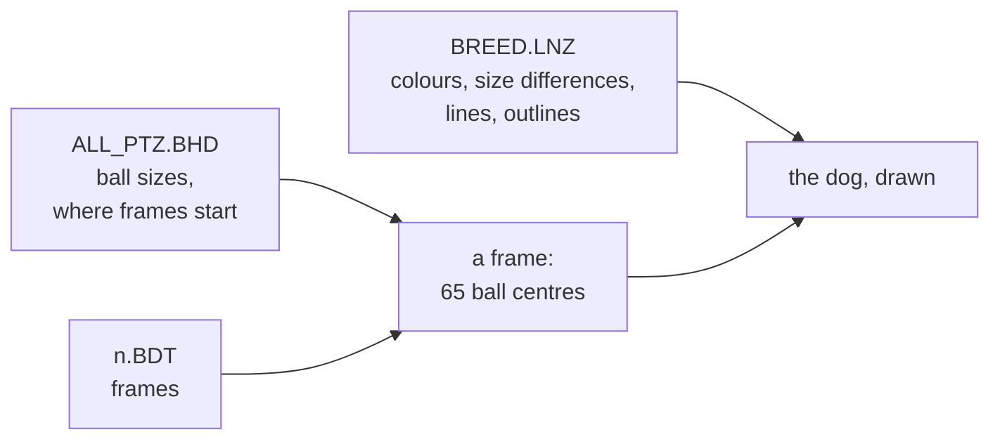

Dogz draws its pets in real time, out of balls: filled circles in three dimensions, drawn nearest last, joined by thick lines. Every breed shares one skeleton of 65 balls and its 36 animations ([[format:bhd]], [[format:bdt]]). A breed file ([[format:lnz]]) says how each ball looks. [[file:WINDOWS/DOGZDLL.DLL]]'s class `Ballz` and `XDrawPort`'s `XFillCircle` are where the game does it.

## What the viewer does

`pnpm dev`, then `/viewer.html`, draws any breed in any frame of any animation, on either display, from the game's own files: the oracle's, in development, or the drive Dogz is installed on chosen in the page, which never leaves the browser.

- [[read out]] Positions: x across, y down, a larger z farther ([[format:bdt]]). Every ball and line is drawn in order of depth, farthest first; a line's depth is its two ends' average.
- Sizes and places: as Dogz places a ball, for the breed's scales at an age and a way the dog is turned (below), shown twice the size.
- Lines: from the `Linez` section, in the first ball's colour, each end as thick as `DisplayBallzFrame` works out for it (below). How `XDrawLine` draws them is not yet read.
- Outlines: from `Outline Type` and `Outline Color`; a half outline is drawn round the lower half of the ball. Not yet measured.
- Balls: drawn as Dogz draws them, into palette indices a row of pixels at a time, with their fuzz, speckles and outlines (below), and shown through Dogz's own palettes; the irises and pupils in their eyes, but not yet the eyelids.

## The 16-colour display

`node scripts/oracle/variant.mjs terrier16 --display vga --breed terrier`, then `node scripts/oracle/shoot.mjs terrier16`, runs the oracle's Dogz on Windows' VGA driver with the dog made a terrier, and keeps pictures of it; the same for any breed.

- [[measured]] On the VGA driver the oracle's screen has exactly 16 colours, and the dog is drawn in them solid, without dithering: (0, 0, 0), (170, 0, 85), (0, 170, 85), (170, 170, 85), (0, 0, 170), (170, 85, 170), (85, 170, 170), (134, 138, 142), (195, 199, 203), and full red, green, yellow, blue, magenta, cyan and white. Windows' own colours are among them, by their use: its title bars are (0, 0, 170), its button faces (195, 199, 203).
- [[measured]] Each breed is drawn in the colours its `[16 Ball Color]` numbers name, in the order of the files' comment: the big dog red with its legs in colour 1, the terrier in colours 6 and 4 (a teal and a dark blue), the Scottie black, the bulldog in 3 and 1, the chihuahua in 3, 2 and 10 — a green dog. The irises are colour 2 or 3, as `[16 Iris Color]` says.
- [[measured]] Colour 7 is the dark grey, as the comment says ("7dkGry") and Windows' own order does not: the bulldog's 24 balls of colour 7 are drawn in the playpen's own grey, (134, 138, 142), and vanish into it but for their outlines.
- [[read out]] The game's own 16 colours are Windows' standard ones, with 128 for the dark colours, 7 the grey (128, 128, 128) and 8 the light grey (192, 192, 192): resource 10016 (below). [[inferred]] So the oracle shows the dark colours as mixes of 170 and 85 because of how DOSBox's ET4000 displays the VGA driver's palette, not because Dogz asks for them.

## Dogz's palettes

- [[read out]] `XDrawPort::InitStaticDraw` (seg8:0c8b) loads Dogz's palette as a resource of [[file:WINDOWS/DOGZDLL.DLL]] with `XMemory::XLoadResource` and keeps it as the palette table its drawing reads, a far pointer at `ds:3120` (seg8:0dd9 to 0e1e). Which resource depends on the display: on more than 4 bits a pixel, id 10256 (`0x2810`); otherwise 10016 (`0x2720`). Both are of type 32513, and are RGB triples, three bytes a colour: 256 colours and 16. `src/formats/palette.ts` reads them.
- [[read out]] The breeds' `[256 Ball Color]` numbers index the 256-colour palette, and `[16 Ball Color]` the 16. In the 256, a breed's coat is a ramp of shades, one way or the other: the big dog's 130 to 135 run from (111, 16, 0) to (157, 82, 19), the terrier's 28 to 33 are tans from (212, 147, 68) down, the chihuahua's 64 to 69 olives, the Scottie's 100 to 105 near-blacks from (25, 22, 22).
- [[measured]] On the oracle's 256-colour display, every colour Bootz is drawn in is one of these, after the VGA's six bits a channel: its coat is entries 130 to 135, where its file gives 131 to 135, and the darker reds are 46 to 51 and 80, where it gives 49 to 51, 79 and 80. [[refused]] That a ball is shaded down its colour's ramp: entry 130 is the chest's own colour, not a shadow of the head's 131.
- [[read out]] `XDrawPort::XInitScreenPort` (seg8:11c9) also makes three ramps of eight with `MakeColorRamp`, into entries 164 to 171, 172 to 179 and 180 to 187 (seg8:16c9 to 1775). `MakeColorRamp` (seg8:1a71) blends two colours linearly, clamped at 255. [[inferred]] These are for colours the game changes at run time, such as the brush's. `MakeColorRamp` is a virtual method, slot 17 of `XDrawPort`'s table at seg8:994a, and is called only through it.
- [[measured]] The screen's own palette, as the 256-colour playpens [[file:DOGZ.DOG/PLAYPENZ/256GRASS.BMP]], `256BONE.BMP` and `256PFM.BMP` carry it, is laid out as Windows' identity palette: the twenty static colours at 0 to 9 and 246 to 255, and Dogz's colours between, in another order. [[refused]] Reading the breeds' numbers as indices of that palette, or of `DOGZDLL.DLL`'s own bitmaps' palettes: the big dog's 130 to 135 would be a purple, an olive, a pale cyan, a brown, a grey-cyan and a tan.

## Where a ball is drawn

- [[read out]] `Ballz::GetCartesianCoordinates` (seg10:367a) places each ball of a frame. Each coordinate is multiplied by a scale of the dog's state and shifted right by 8, so the scales are in 256ths. The ball is then turned about the upright axis by the way the dog faces, and tilted by a pitch made from that: `-7 - |64 - |yaw|| / 10`, so more from above when the dog faces out (13) than side-on (7). Angles are in 256ths of a turn, from tables of sines and cosines times 256 for -128 to 128 that seg11:1c27 builds. Head tracking and three more turns of the state come between, not yet read.
- [[read out]] A ball's radius is its size times the dog's ball scale, shifted right by 9 (seg10:367a): its diameter is its size times the ball scale in 256ths. `Ballz::LoadSpecialBallInfo` (seg10:1421) makes the size the skeleton's ([[format:bhd]]) with **half** the breed's `[Ball Size Diffs]`, and `Ballz::SetPuppiness` (seg10:2469) adds half its `[Puppy Balls]` times the dog's puppiness in hundredths. [[inferred]] The puppiness is 100 less the age: `SetBallScaleFromAge` passes that to a setter of the same shape.
- [[read out]] `PetModule::SetBallScaleFromAge` (seg21:4c4c) sets the scales from the breed's `[Default Scales]` by the dog's age, its factor 10 of 100: `age × (adult - puppy) / 100 + puppy`, for the pet scale from the first and third numbers and the ball scale from the second and fourth. The big dog's 220, 220, 140 and 200 make a puppy's positions 140 256ths and its balls 200: smaller, with bigger balls for its size.
- [[read out]] `DisplayBallzFrame` gives `XDrawLine` each end of a line as thick as its ball's radius × 256 / 300 (seg10:5134).
- By eye, the viewer's terrier turned side-on is the size and shape of the oracle's, [[guide:reproducing|shot]] on the 16-colour display: `src/render/project.ts` places balls by these rules. Not yet measured pixel for pixel; the dogs' poses on the oracle are not known frame for frame.

## How a ball is drawn

- [[measured]] Close up, each ball on the oracle's 256-colour screen is one flat colour, its own number: the big dog's head and belly 131, its chest 130, its tongue 80. Across them are single pixels three entries up the ramp, 134 in the 131, and black outlines along parts of the balls' edges. There is no gradient: Dogz does not shade a ball, it fuzzes, speckles and outlines it.
- [[read out]] `Ballz::DisplayBallzFrame` (seg10:4d28) draws each ball through `XDrawPort`'s virtual `XFillPartialCircle` (slot 5; seg10:52ea, 56ec and 573f) and joins balls with its `XDrawLine` (slot 15, seg10:5134). A ball's call passes its rectangle, two colour bytes from per-ball tables of the `Ballz` (at offsets `0xdc9` and `0x1461`), a third colour and a mode from two more (`0x1281` and `0x1371`), its diameter, and a level from another (`0x1551`) plus an adjustment. One case passes the mode -4 and the ball's own number in place of the third colour. [[inferred]] The tables are the breed's colour, outline colour, speckle colour, outline type and fuzz.
- [[read out]] Everything reaches `XFillPartialCircleKernel` (seg8:347d, slot 7). It clamps the level to 7 and looks the three colours up through seg8:002a: on a 256-colour display through a table of Dogz's colours to the screen's, on 16 colours as they are. Then, by the mode:
  - **-1**, no outline: each row of the circle is filled in the ball's colour, and each row in its upper half has one pixel, at a random place from the row's start to one past its end, in the third colour.
  - **0**, a half outline: the same, with each row's leftmost pixel in the second colour.
  - **more than 0**, an outline that many pixels thick: that many whole rows at the top in the second colour, then rows with that many pixels of it at each end, the ball's colour between; no speckles.
  - **-2** fills only the part of the circle to one side of a line at an angle, and **-4** fills it from a ramp of colours down its rows. [[inferred]] These are the eyelids and the eyes. Not yet read in full.
- [[read out]] `XDrawPort::InitCircleLookup` (seg8:200f) builds, for every diameter from 1 to 119, each row's width, `sqrt(d² - (d - 2r)²)` for rows `r` from 1 to `d`, from a table of square roots; a random place in each row (`theirCircleSpotMemory`), where the speckle goes; and eight tables of each row's start shifted right by a random 0 to 7 pixels, one for each level. The level is the fuzz: a fuzzier ball has raggeder edges, its rows as wide as ever.
- [[read out]] The third colour is the speckles'. `Ballz::GenerateSpeckleColors` (seg10:21da) makes it from the ball's colour, for every ball the breed gives a `Speckle Color` of 0 or more, by reflecting it within its ramp: `s + (s + R - 1 - c)`, where `s` is the first colour of `c`'s ramp. `XDrawPort::InitStaticDraw` sets the ramps on a 256-colour display at 20 of 6 colours from 16 — 16 to 21, up to 130 to 135 — and on 16 colours at one colour each.
- [[measured]] That is what the oracle shows: the big dog's 131 speckles in 134, the far end of its ramp from 130. `src/render/raster.ts` draws by these rules, and the viewer with it.

## The eyes

- [[read out]] The irises are not drawn with the other balls. After drawing each eye, `DisplayBallzFrame` draws its iris inside it (seg10:5440 to 573f): where the iris is relative to its eye in the frame, or toward a point the dog looks at, or in the middle, by the dog's state; eased toward that place 0.6 pixels a frame (`ds:1d36`); and kept within the eye, on each axis, by the eye's radius less 0.8 of the iris's (`ds:1d3e`).
- [[read out]] The iris is filled flat in the breed's iris colour, without fuzz, speckles or outline. If it is more than 7 pixels across, it is inset 2 pixels on every side and filled again in the pupil colour (seg10:56f3 to 573f).
- [[read out]] `Ballz::LoadSpecialBallInfo` reads the colours: the iris's from `[256 Iris Color]` or `[16 Iris Color]`, by the display, or 3 where the breed gives none, as the bulldog and the chihuahua do; the pupil's from `[Pupil Color]`, which no breed has, or 0. It reads the eyelids' from `[256 Eyelid Color]` or `[16 Eyelid Color]`, and `[Key Balls]` too.
- [[read out]] Where the dog's eyelids are closing, a share of each eye is covered by a circle cut along a line at the angle between the eyes, in the eyelid colour (`XFillPartialCircleRotate`, seg10:5b5c). [[inferred]] How far is the dog's state: `PetModule::GetEyelidHeightFromExcitement` is exported. Not yet read.
- [[measured]] On the oracle's 16-colour display, the terrier's irises are a dark-yellow ring with a black pupil, colour 3 then 0, and the big dog's green, its `[16 Iris Color]` of 2.

## Still to find

The eyelids, and how far they close (the kernel's modes -2 and -4); the adjustment `DisplayBallzFrame` adds to the fuzz; how far each row's start is from the ball's centre, exactly; `Puppy Balls` and the extensions; head tracking and the state's other turns; fuzz and speckles; the extras each frame lists; which animation is which; and how fast frames are shown.
